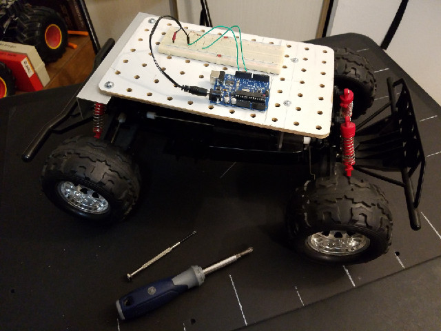
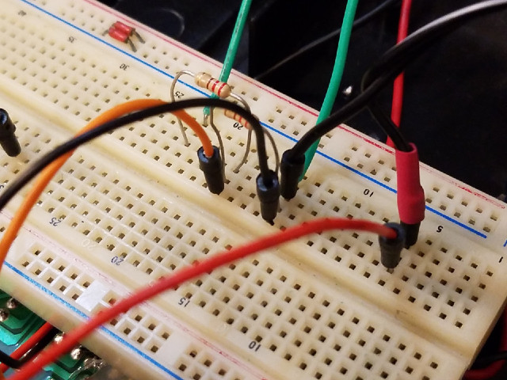
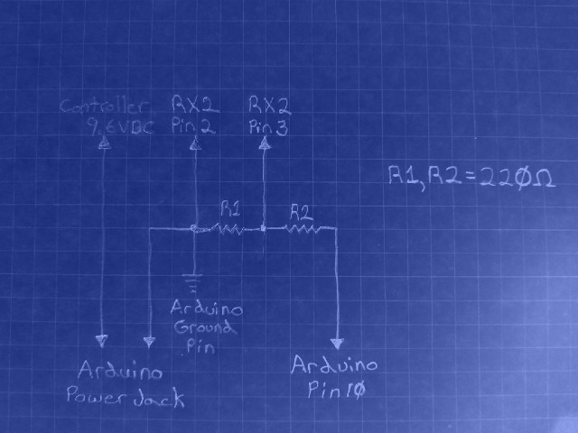
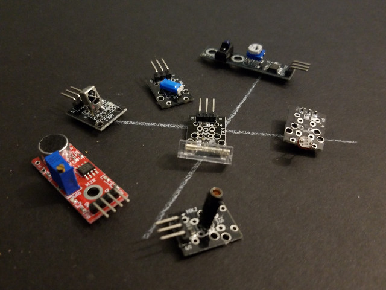

# A Low-Cost Toy RC Car Robot Platform

Check out the latest on this project and tutorial at the [Junkbotix Channel](https://www.youtube.com/channel/UCNxQ47xBEYjD-mey_lxj9Aw) on Youtube!

 

## Mechanical

* [Steering](./steering)
* [Notes](./notes)

 

 

## Platform / Deck

* [Fabrication](./platform-deck)
* [Completed Example](./platform-deck/completed)

 

 

 

## Electronics

* [Interfacing](./interfacing)
* [Sensors](./sensors)
* [Datasheets](./datasheets)

 

## Software

* [Software](./software)