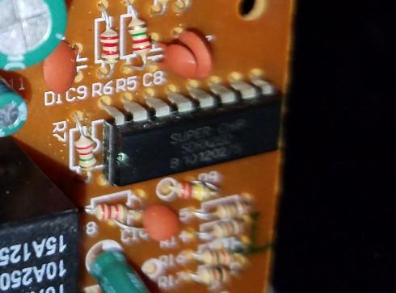

# On-board RC Controller

[SDRX2BD (Super Chip) Datasheet](./SDRX2BD-BaiShengWeiElectronics.pdf)

Woohoo! This is actually a fairly standard RC controller, basically another clone of the TX2-RX2 chipset. What that means, though, is that there is plenty of information out there on how to interface to it.

Also, it means that with the pins being identified, we can easily bypass the chip, and interface directly to the on-board h-bridge circuits, assuming they all still work:

[RX2 Bypassing](../../interfacing/rx2-bypassing)

That said, in the future I will probably completely remove everything, including the steering actuator, and replace them with proper RC components (an ESC and a servo), as I have a ton of them in my junk pile as well that I've collected over the years...

## Update...

The TX2-RX2 chipset is one that has been widely cloned by a number of companies. The original version was created by Realtek:

[Realtek TX2-RX2 Datasheet](./TX2RX2-Realtek.pdf)

The nice thing about the Realtek datasheet is that it includes timing diagrams for the signals emitted by the encoding transmitter IC (TX2), so that they may be easily simulated by an embedded controller. Instead of "bypassing" the chip and interfacing directly with the h-bridges, which can take multiple pins, we can instead use a single pin! I call this method "direct signal injection":

[Direct Signal Injection](../../interfacing/signal-injection)