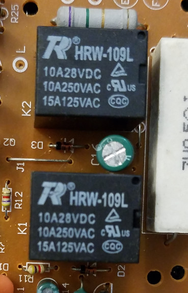

# Drive Motor H-Bridge Relays

[HRW-1 Datasheet](./HRW-1xxx-RCElectronics.pdf)

These are basic SPDT power relays with high-amperage contacts (10A @ 28VDC). They are driven by a couple of the transistors to the left of the above image (I haven't identified which, yet).

These relays, according to the datasheet, have a "vented plastic case", a 9 volt DC coil (40 mA, 225 ohms), and "silver alloy" contacts (L-1 Form C).

No idea what "silver alloy" is used, but all of them seem meant for preventing welding of the contacts under high-current loads (such as the motor in my toy RC vehicle):

https://electronic-products-design.com/geek-area/electronics/relays/relay-contact-materials

What does "Form C" mean? Contact Configurations:

https://forum.digikey.com/t/understanding-form-a-form-b-form-c-contact-configuration/811

More information on h-bridges can be found here:

https://en.wikipedia.org/wiki/H-bridge

...and on relays (SPDT and others) here:

* https://theorycircuit.com/spdt-relay-dpdt-relay/
* https://www.the12volt.com/relays/spdt-and-spst-automotive-relays.asp