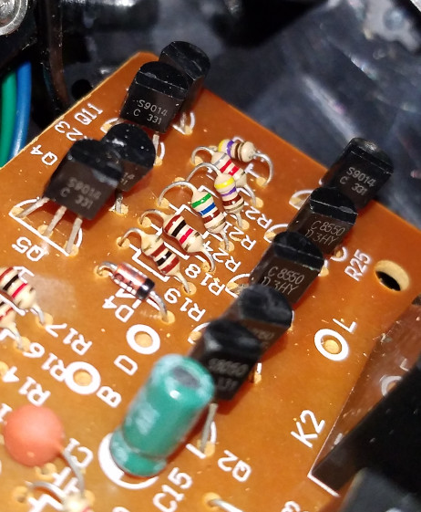

# Drive Motor and Steering Actuator H-Bridge Transistors

I have only included datasheets here which are the closest match to the numbers on my transistors.

The following transistors were identified:

* [C8050 (TO-92 NPN)](./C8050-NPN-TO-92/C8050-Usha.pdf)
* [C8550 (TO-92 PNP)](./C8550-PNP-TO-92/C8550-Usha.pdf)
* [S8050 (TO-92 NPN)](./S8050-NPN-TO-92/S8050-UTC.pdf)

I found two datasheets for this transistor:

* [S9014 (TO-92 NPN) - Datasheet 1](./S9014-NPN-TO-92/S9014-ME.pdf)
* [S9014 (TO-92 NPN) - Datasheet 2](./S9014-NPN-TO-92/S9014-Weitron.pdf)

I haven't yet figured out which transistors control and belong to the steering actuator h-bridge, and which ones control the drive motor h-bridge relays. Nor have I determined how or what the extra wires from the steering actuator are for.

Again, my best guess is that they are meant to act as some means of limit switching to prevent overload of the control circuitry, or something of that nature. To figure out either will require a reverse-engineering of the circuit board schematic, which I may undertake at a later point.