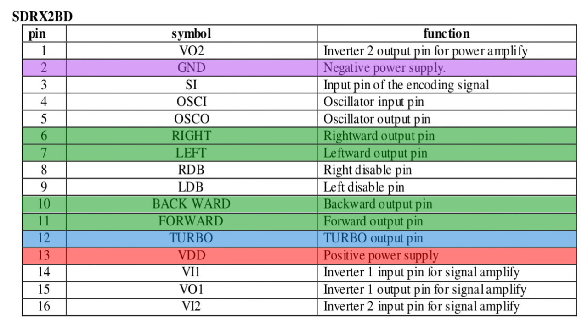
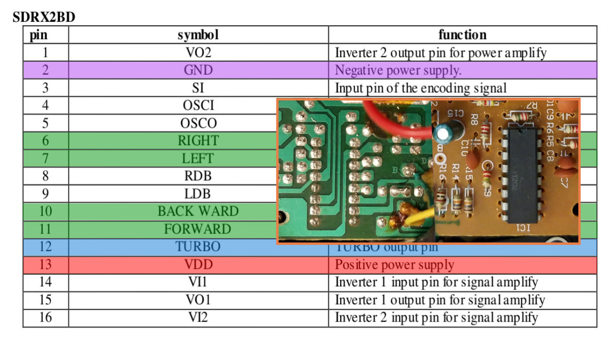
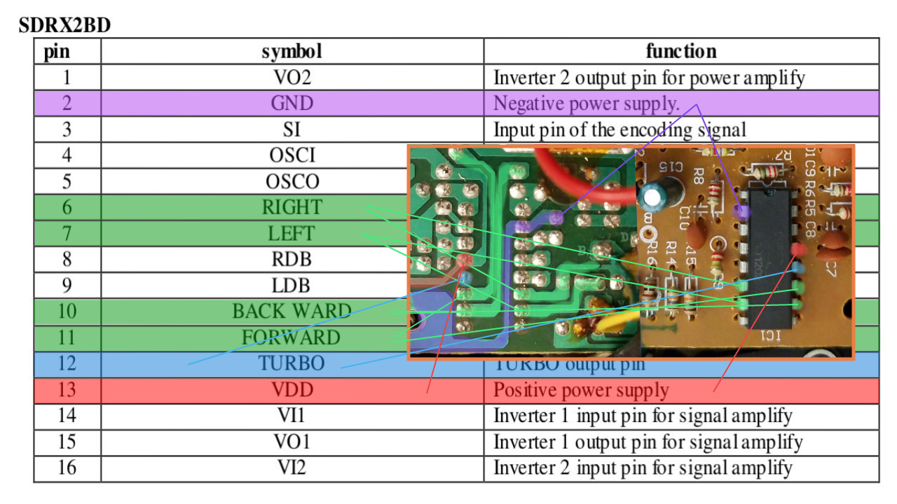

# Bypassing the RX2 chip

Bypassing the chip on the board is fairly simple. The diagrams included here should help, but I also want to refer you to an old thread on the Arduino Forum, which has a ton of useful information:

https://forum.arduino.cc/index.php?topic=86883.0

Another good thread:

https://forum.arduino.cc/index.php?topic=368867.0

## RX2 chip functions:

## Top and Bottom comparison of Thunder XX controller board:

## RX2 chip functions - Annotations:

