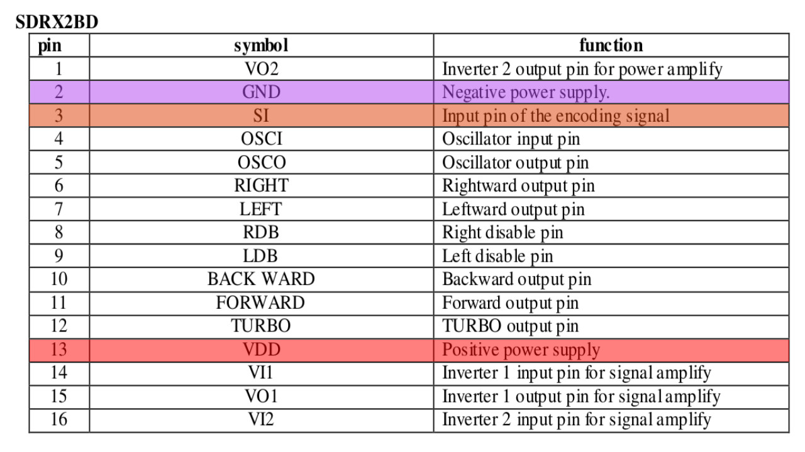
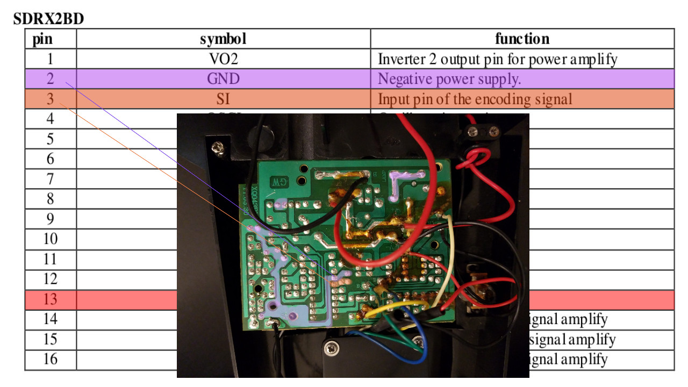
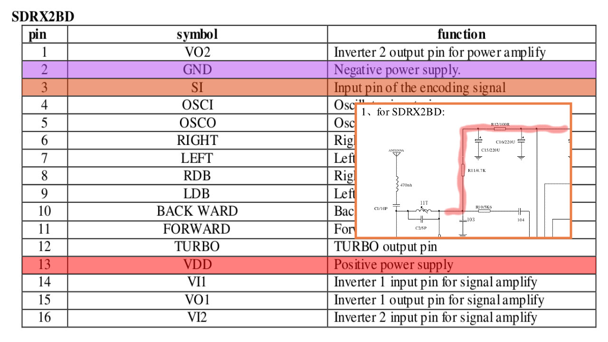

# Direct Signal Injection

A potentially simpler solution, and one that uses far fewer pins (opening up a variety of possibilities!) uses a technique that I like to call "direct signal injection". I won't go into extreme detail, but it basically involves slight modifications to the controller board and then using your embedded controller to simulate the signals that go into pin 3 on the chip, in place of what would normally be picked up by the RF radio receiver section. More on this technique can be found at the Arduino forum:

https://forum.arduino.cc/index.php?topic=171238.0

As well at the following two Github repositories:

https://github.com/dimircea/RX2-TX2-RC

https://github.com/monsieurDavid/rx2-hacks

And my own [implementation](../../software/arduino)...

## Pins to use:

## On the controller board:

## Power path to RF section (reference implementation):

