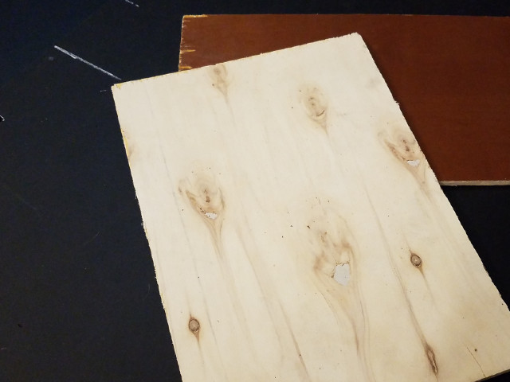
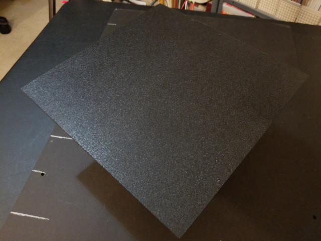
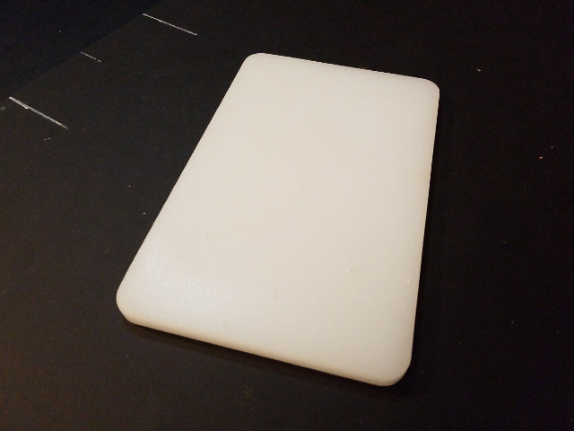
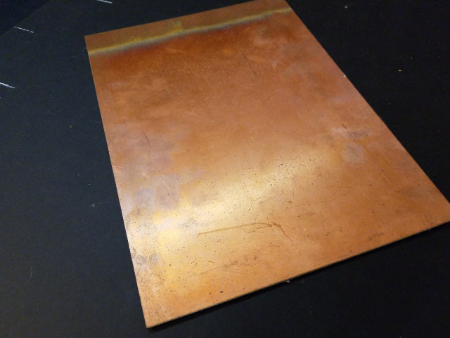
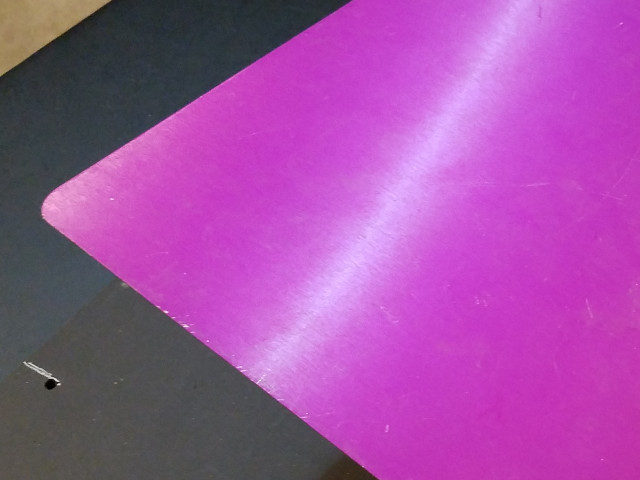

# Table of Materials

## Definitions

* Material - Type of material for building your deck
* Cost - How much you can expect to spend (approximately)
* Weight - How heavy it will be (approximately)
* Strength - How well it resists bending under weight
* Workability - How easy it is to work with (cutting, drilling, etc)
* Tools - The complexity of tools are needed to work with it
* Free/Trash - Likelyhood of getting it free or finding it in the trash
* Notes - Any additional notes about the material

### Ratings&nbsp;&nbsp;&nbsp;\* = Low&nbsp;&nbsp;&nbsp;\*** = Medium&nbsp;&nbsp;&nbsp;\***** = High

 

|      Material      | Cost  | Weight | Strength | Workability | Tools | Free/Trash | Notes
| :----------------: | :---: | :----: | :------: | :---------: | :---: | :--------: | :-----------------------------------
|     Cardboard      | *     | *      | *        | *****       | *     | *****      | Don't need much to work with this - just some very simple tools and hot glue. With proper construction techniques, can be made stronger. 
|      Foamcore      | *     | *      | ***      | *****       | *     | *          | Easy to work with like cardboard, but stronger!
|      Plywood       | ***   | ***    | ***      | ****        | ***   | ***        | Simple hand tools is all that is needed to work this material, if you can get it precut into less than a full-sized sheet. (^1)
|      Pegboard      | ***   | ***    | ***      | ****        | ***   | ****       | More likely to find someone giving this away; it's main advantage is the pre-drilled holes in a standard pattern. (^1)
|   Sheet Plastics
| Corrogated Plastic | ***   | *      | **       | ****        | *     | ****       | Many of the advantages of cardboard and foamcore, but with greater strength - and it's weather resistant!
|        PVC         | ****  | **     | ****     | ****        | **    | *          | This is a specialty plastic, and not low cost for larger sizes - but easy to work with! (^1,2,3)
|        ABS         | ****  | **     | ****     | ****        | **    | *          | " (^1) 
|      Acrylic       | ****  | **     | ****     | ****        | **    | **         | " (^1,2,4)
|        HDPE        | ****  | ***    | *****    | ****        | ***   | ***        | Most of the same tooling as used for plywood can be used; often found in the trash as used cutting boards (sandwich shops). (^1)
|        PCB         | **    | **     | ***      | ****        | **    | *          | Can be easy to work with using many common hand tools, but can be very abrasive to drills and cutting blades, depending on composition (especially FR4). (^1,2,5)
|    Sheet Metals
|      Aluminium     | ***** | ***    | *****    | **          | ****  | *          | Drills and cuts fairly easily with power tools; can be worth the effort for the advantages, but usually has to be bought new (look for smaller off-cuts at the metal yard for savings). (^1,6)
|       Steel        | ***** | *****  | *****    | *           | ***** | ***        | Depending on the size, gauge (thickness), and other specifics, steel can be worked with many of the same tools as aluminium, but some additional skills and special tools may be required for some fabrication needs. (^1,6)

---

## Notes on Safety

* ^1 = Wear eye protection and a dust mask
* ^2 = Wear a dust mask or respirator
* ^3 = Do not overheat or burn PVC, as extremely toxic gases will be released!
* ^4 = "Snapped" acrylic can be sharp - use caution!
* ^5 = FR4 (fiberglass) dust should not be inhaled, and can be an irritant to skin, eyes, throat, lungs, etc!
* ^6 = Use caution around sharp edges and swarf from drilling!

Be sure to clean up working area after any cutting or drilling, especially of PCB material or of metals. Always were appropriate PPE (personal protection equipment) for the materials being used or handled. 

Again, freshly cut metals and acrylic can have very sharp edges, use caution when handling; file, sand, and/or burnish as appropriate to reduce this hazard.

## Disclaimer

The above table, notes, and safety notices are NOT to be considered complete or authoritative; please consult the appropriate MSDS or other safety and specifications documentation for the material(s) being used or considered, as needed.

## Examples of Materials

### Plywood

### Pegboard (1 inch standard)

### Sheet ABS

### Sheet HDPE (small cutting board)

### PCB Material (single side copper clad FR4)

### Aluminium (this example is color anodized):
