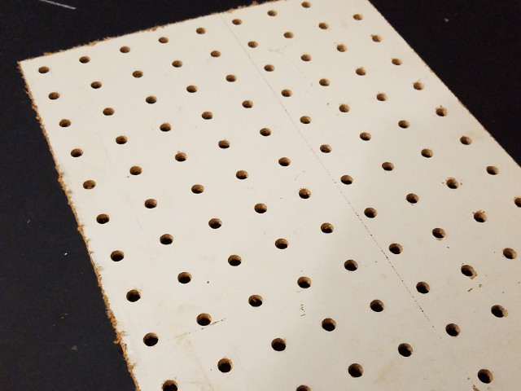
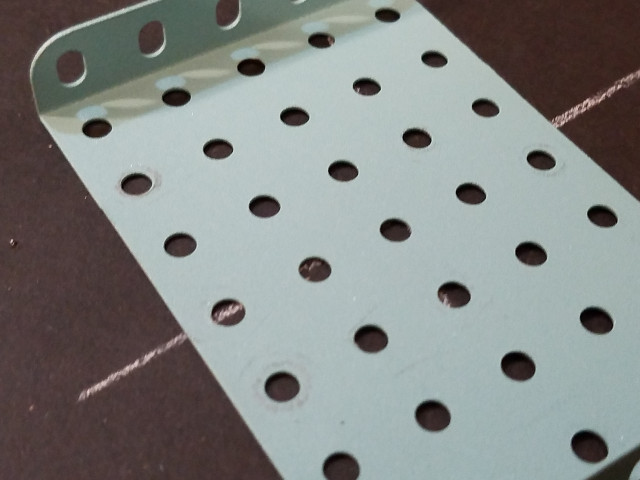
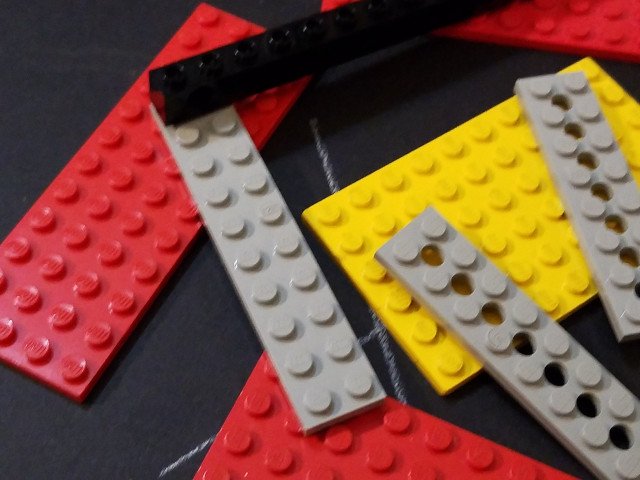
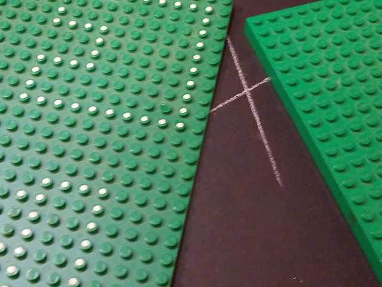
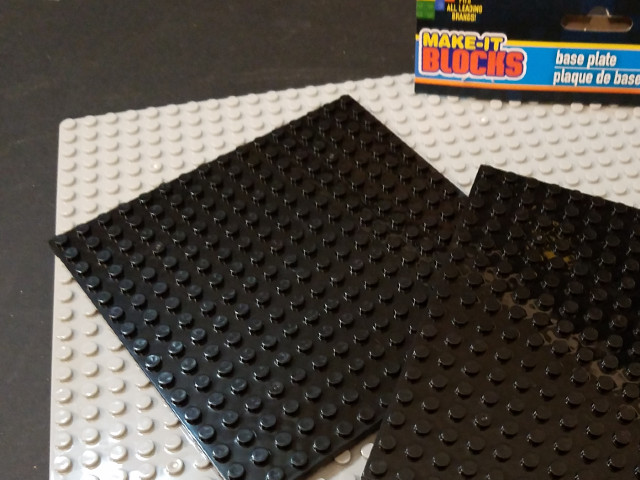
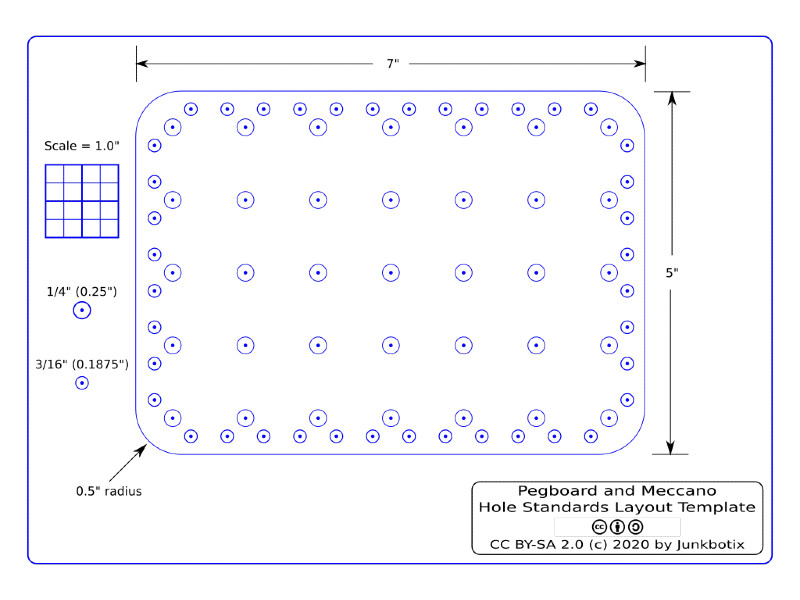

# Platform Deck Plates: Using Pegboard, Meccano, and Lego Technic

As you develop your robotics platform, you may find you need one or more "deck plates" of some kind to hold your embedded system, electronics, sensors, batteries, or whatever else you need in order to complete your system.

Pegboard, Meccano, and Lego all provide what can be called a "suitable standard" for such purposes.

 

## Pegboard

Pegboard can be found at almost any hardware or home improvement store, but it usually only comes in large sheets or half-sheets, which can make it difficult to work with, for the scale and purpose of this project, where only a small piece is really needed. However, it is fairly inexpensive for the "hardboard" version.

You may be able to have it cut down to more manageable sizes by the store, but another method to consider is to ask others (relatives, friends, neighbors) if they have any scrap pieces you can have. 

I did this myself for the piece you see in the video - I posted up an ISO (in search of) ad on Nextdoor for my neighborhood, and within a few minutes somebody responded to my request!

If you do go this route, be sure to inquire about the size of the piece. Don't walk down the street only to find you may have to carry a full-sized sheet home!

You can also find plastic and metal pegboard, both in full sheets and smaller sizes, but such materials can be more difficult to work with (and may be heavier for your platform).

 

## Meccano

Official Meccano can be both easy and difficult to find, depending on your perspective. It is mostly made from thin gauge steel, but the larger plates, adaptable for a small robotics platform, can be difficult to find (and may be expensive). 

If you really want to use Meccano (or some other steel construction set or parts) on your robotics platform, my suggestion is to use it for the smaller brackets. For a larger plate, consider drilling out a piece of pegboard (add holes in between the standard 1" spaced holes), or cutting and drilling a piece of 1/8" plywood, and adding the proper spaced holes to that. The templates provided below can help with this.

You may be able to find pre-drilled sheet metal with a 1" or 1/2" hole pattern that can be adapted to your purposes, but remember to take into account the amount of weight your platform can carry.

 

## Lego Technic

Lego, in their Technic-based kits, have "girders" of various lengths which have an 8 millimeter hole spacing pattern:

https://www.bricklink.com/catalogList.asp?catType=P&catString=135

There are also smaller flat plates with holes of the same spacing in a single-line:

* 2x4 with 3 holes (https://www.bricklink.com/v2/catalog/catalogitem.page?P=3709b)
* 2x6 with 5 holes (https://www.bricklink.com/v2/catalog/catalogitem.page?P=32001)
* 2x8 with 7 holes (https://www.bricklink.com/v2/catalog/catalogitem.page?P=3738)

Larger area flat plates with multiple holes in a grid, though, are not available (to my knowledge). Of the non-Technic Lego flat plates which are available, the largest size is that of 16x16 studs (approximately 127x127mm):

https://www.bricklink.com/v2/catalog/catalogitem.page?P=91405

At that size, given the thickness of the plates (3.2mm), they are pretty flexible, and won't hold a lot of weight. So it might be better to go with a thicker Lego "baseplate" instead:

https://www.bricklink.com/catalogList.asp?catType=P&catString=2

Other options would be to look into plates from "Lego-compatible" kits: 

Whatever type or size plate you select, you can (in theory) replicate the hole pattern in it by drilling "on center" between the studs, using a proper drill bit (see below).

 

## Suitable Materials for Decks

* [Materials](./MATERIALS.md)

This file presents a number of materials, their properties, relative costs, and other information in a tabular format. It provides a quick and easy overview of what you can use to fabricate your deck.

## Adapters

* [Mounting Adapters](./adapters)

This file discusses the need for building adapters to mount components on to a deck. A simple example implementation is also presented in detail.

## Custom Standoffs

* [Standoffs](./STANDOFFS.md)

Many times you need standoffs for your deck and chassis, but may not have any on hand, or they may not be the right length. This file details some alternatives.

## Hole Pattern Standards

* [Standard Hole Patterns](./STANDARDS.md)

This file describes three fairly common hole-pattern standards:

* 1" (inch) pegboard standard
* 1/2" (inch) Meccano standard
* 8mm (millimeter) Lego Technic standard

...which are suitable for small-to-medium scale robotics development.

 

## Cutting and Drilling Templates

These were developed using Inkscape, and are provided to assist you in designing and fabricating hole patterns in your choice of materials. These are multi-layer drawings, with layers named intuitively (well, that's the goal), allowing you to quickly and easily create several different hole patterns, simply by displaying and hiding the layers needed. Or, if you need something custom, all the parts are there to create your own layouts:

* [Pegboard & Meccano Template](./templates/pegboard-meccano.svg)
* [Lego Technic Template](./templates/lego-technic.svg)

You can use these patterns by loading them in Inkscape (or other vector graphics processing software, such as Adobe Illustrator), setting the layers how you want, and then printing them out. Be sure to verify the proper sizing/scaling to match (a scale is provided on the templates for this purpose).

Once printed, you can cut out the pattern, and affix it to your material using tape or glue, then cut it out (a scroll saw is preferable for this, but hand saws and other methods could work ok, too) and drill your holes, etc.

You could also print these out using a laser printer then do a "toner transfer" to your material (wood, metal, or PCB), and use the result directly as a guide for cutting and drilling.

If you need accuracy for your holes, use a drill press and/or a hole spacing jig as a way to keep things aligned. Otherwise, center punch the holes to keep your drill bit from "walking" on the material as you drill it. The templates have a "dot" in the middle of the hole indicators for this purpose.

While not explicitly designed for such use, they should be adaptable to use with laser cutters, CNC routers, and 3D printers.

 

## Notes on Background Layout Grids

For the Pegboard & Meccano Template, the Inkscape Page and Grids (Document Properties) should be set as:

### Page

* Display Units = in
* Page Size = US Letter, 11.00000 (W) x 8.50000 (H) in
* Scale X, Y = 4.00000 (User Units per in)
  
### Grids

* Grid Units = in
* Origin X = 0.00000
* Origin Y = 0.00000
* Spacing X = 0.12500
* Spacing Y = 0.12500
* Major Grid Line every = 4

 

For the Lego Technic Template, the Inkscape Page and Grids (Document Properties) should be set as:

### Page

* Display Units = mm
* Page Size = US Letter, 279.39999 (W) x 219.89999 (H) mm
* Scale X, Y = 0.40000 (User Units per mm)
  
### Grids

* Grid Units = mm
* Origin X = 0.00000
* Origin Y = 0.00000
* Spacing X = 1.00000
* Spacing Y = 1.00000
* Major Grid Line every = 8