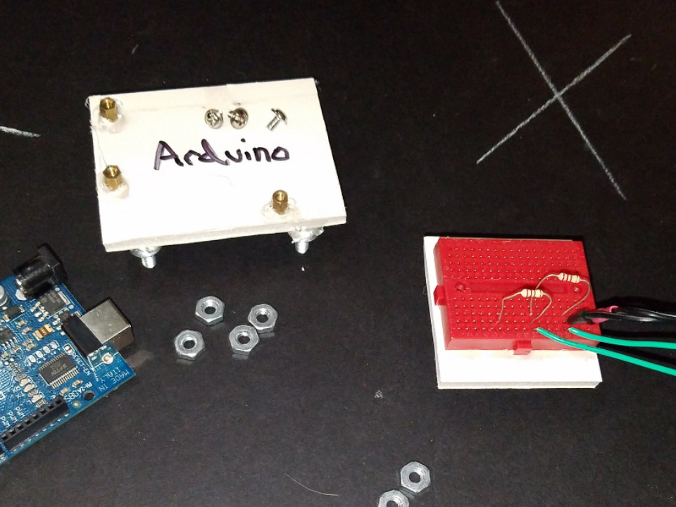
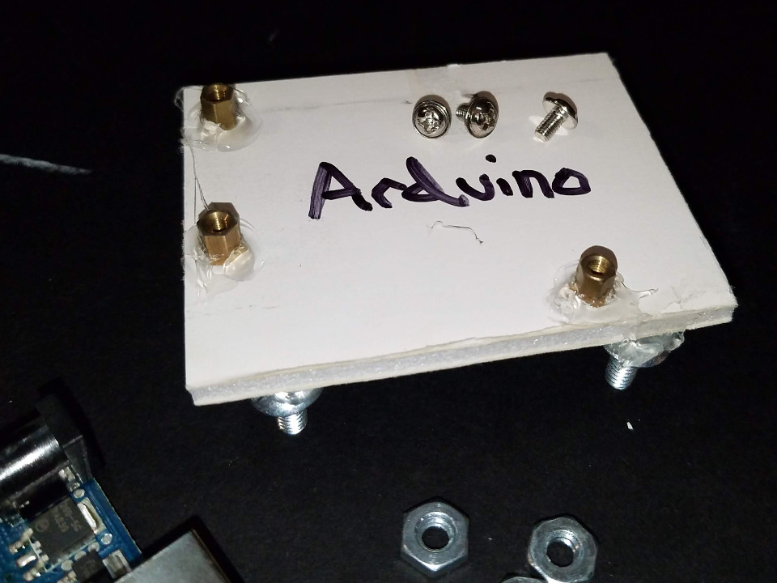
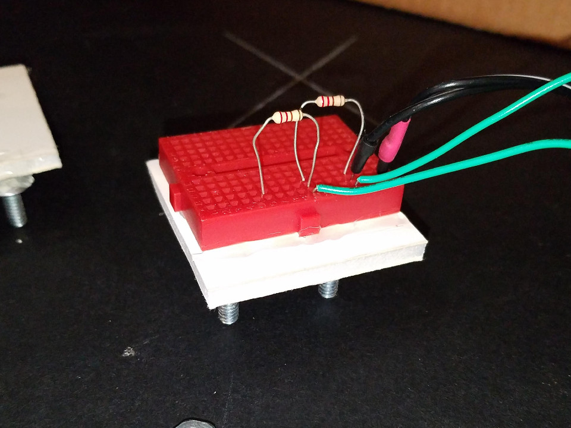
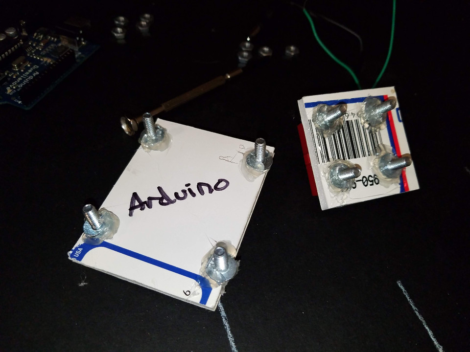
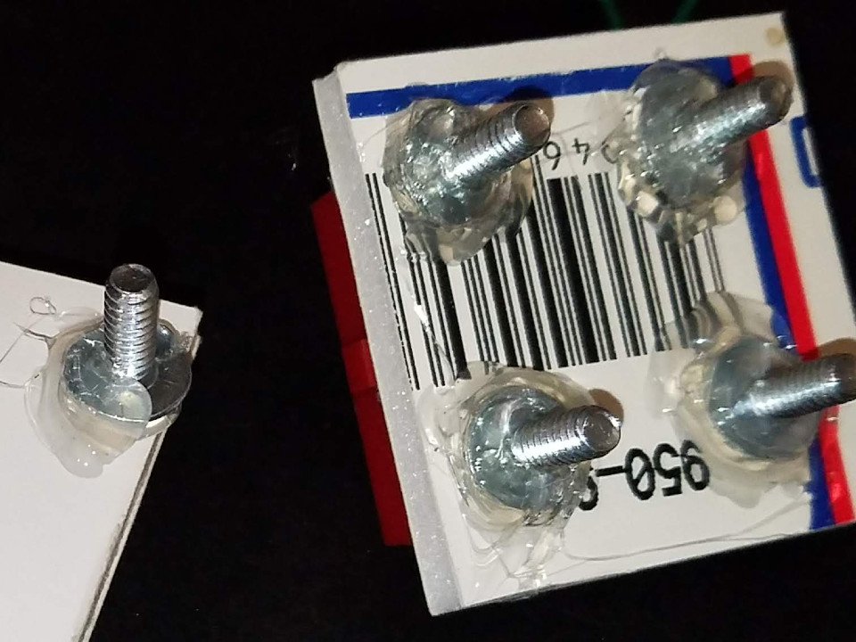
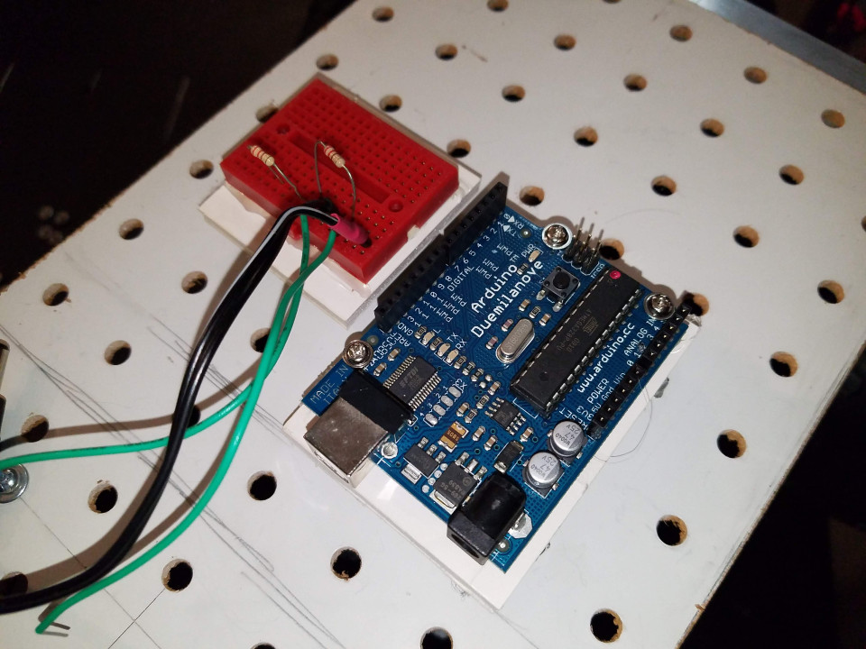

# Mounting Adapters

Regardless of what kind of hole standard or material you choose to implement a deck with, invariably you will want and need to mount components and other parts to it, which may or may not conform to the hole spacing of the standard. Most likely it won't.

Thus the need for mounting adapters.

These can be simple to complex implements, limited only by your imagination. But their basic form and purpose is simple: To provide an easy way to mount components and boards to the hole standard and material selected for the deck.

I implemented a couple of simple adapters for the pegboard deck of my robot. I want to share them with you, and how I developed them, so that you can see the idea, reasoning, and process behind their creation, which may help you to build your own adapters.

## Overview

Here you can see the two basic adapters I built. I made them out of simple foamcore board I had, but you could do the same with carboard, plywood, or sheet metal/plastic. In the case of a pegboard deck, even small pieces of pegboard could be used. Or you could 3D print adapters, if you have that option available.

## Arduino Adapter

The adapter is made from a small piece of foamcore, on to which screws were hot glued to the "bottom" to fit with the pegboard standard (1 x 1" grid). I did this by mounting the screws to a spare piece of pegboard, adding hot glue to the heads, then quickly adding the piece of foamcore on top. 

Once it had became solid, I carefully removed it from the pegboard, flipped it over, then added more hot glue to "lock" the screws in place (see below).

For the Arduino, I used some small PC motherboard brass standoffs I had laying around. I first mounted them to the Arduino, then firmly (but carefully) pressed the Arduino and standoffs against the foamcore, leaving an impression that I then poked a hole (a small nail works fine), so that the threaded portion of the standoff could be pushed into the foamcore board. Once that was done, I added some more hot glue around the standoffs to hold them firmly in place, then re-assembled the Arduino on the adapter.

## Breadboard Adapter

I did essentially the same thing with the breadboard adapter, except I hot glued the breadboard directly to the foamcore, instead of using PC motherboard standoffs. Motherboard standoffs could have been used, but I felt it wasn't warranted, since I'm unlikely to change the breaboard off the adapter itslef (while I probably would do this with the Arduino adapter).

## Adapter Screws

Both the adapters use the same screws and nuts, and such commonality is something your should carry through on your own implementation. Having only a single type of screw and nut means quicker interchangability and better convenience.

You can see how I "gooped" over the heads of the screws to help "lock" them in place on the bottom. This helps to prevent the screw from coming loose as you use and position the adapter on your deck.

## Adapters Mounted

Here are the two adapters mounted together on the robot's deck. Note the orientation of the adapters and the boards. This can all now be quickly changed and updated at will.

## Component Selection

Components can consist of anything: Embedded systems, sensors, breadboards, LCDs, keyboards, servos...many examples are possible. Let your imagination run wild!

## Other Hole Standards and Deck Materials

Whatever you happen to use for your deck, the process of making an adapter is similar; you are basically building a transition piece to allow the mounting of a component which doesn't fit the selected hole standard(s) being used on the deck.

Such adapters can be simple as seen here, or more complex involving careful design and material selection, to allow an interlocking jigsaw puzzle of various modules as needed. Design and use whatever is best for your needs.