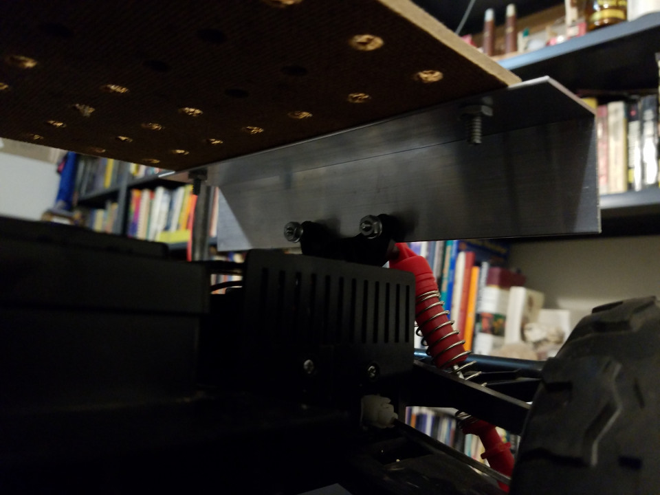
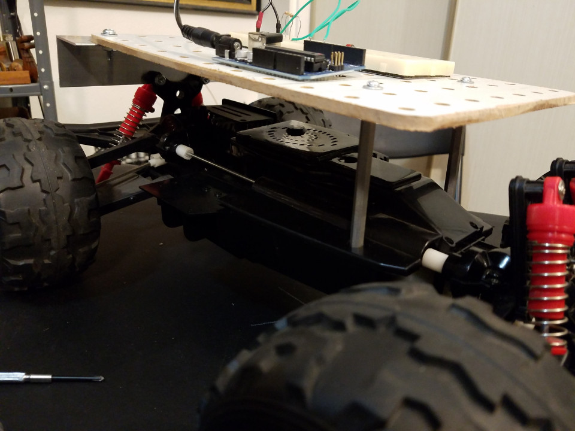
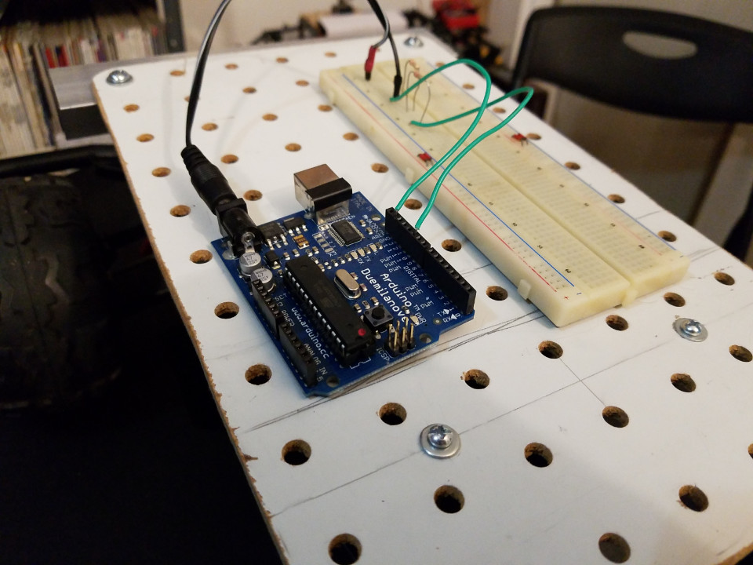
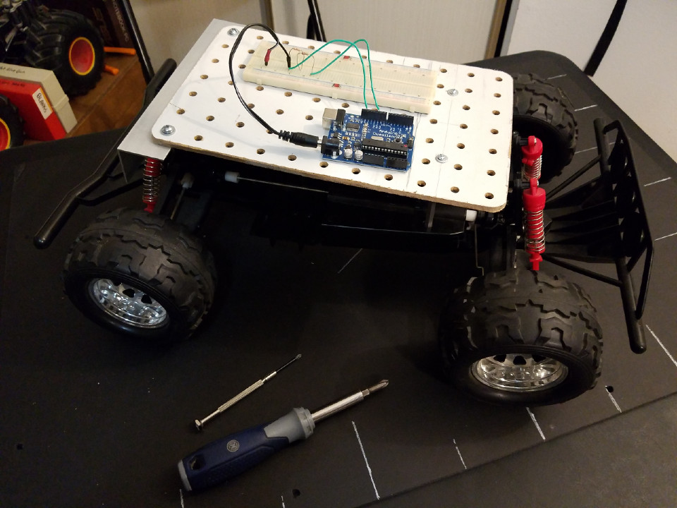

# A Completed Pegboard Example

These are photos of the pegboard deck built for the tutorial video series, on the Thunder XX chassis I used.

## Rear Bracket

## Front Standoffs

## Deck

## Chassis and Deck

