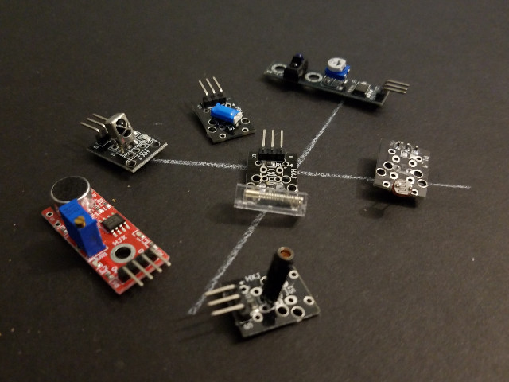
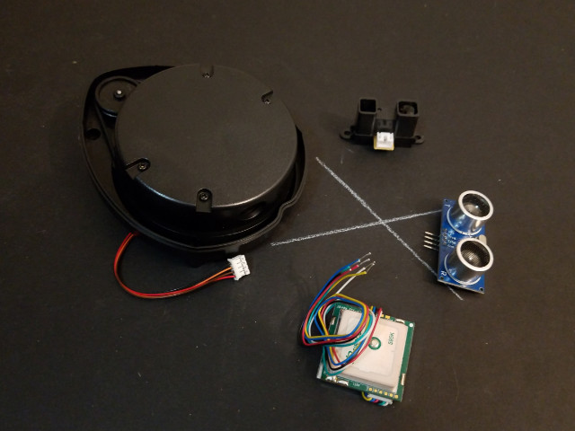

# Sensors

Sensors are needed for your robot so that it can sense the world and react to it, otherwise it is nothing more than a complicated programmable toy. With the addition of sensors, and the software to read and interpret their signals, your robot platform becomes an advanced experimentation and learning tool. What you learn from such a smaller platform can be easily applied to larger platforms you may develop (sometimes with few or zero code changes).

 

# Basic Sensors and Kits

## Sensor Kits

Most of the basic sensors can be purchased, relatively cheaply, as part of one or more kits, which contain all the sensors, and generally a bunch of other components, too (as they are typically geared toward learning electronics and embedded systems, mainly the Arduino). They are a great and inexpensive way to start experimenting quickly.

[Sensor Kits](./kits)

 

## Discrete Components

You can also purchase the discrete components used in the kits, which is useful if you are doing more advanced experiments that such kits don't cover, or you want a custom solution for your system without the bulkiness introduced by using the sensor modules.

[Discrete Components](./components)

 

# Advanced Sensors for Self-Driving and Mapping

* [Ultrasonic Sensors](./ultrasonic-sensors)
* [Sharp IR Sensors](./sharp-ir-sensors)
* [GPS Modules](./gps-modules)
* [LIDAR](./lidar)

 

# Other Sensors

* [Contact Sensors](./contact-sensors)
* [Low Vision Sensors](./low-vision)
* [Smartphone Sensors](./smartphone)