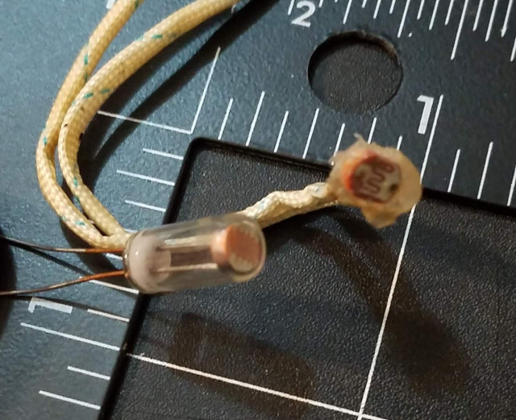
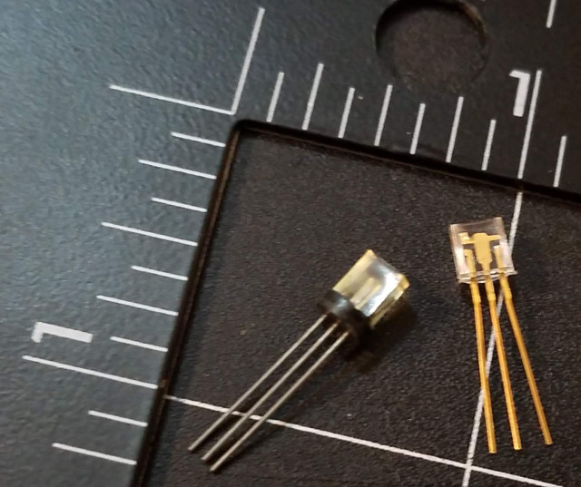
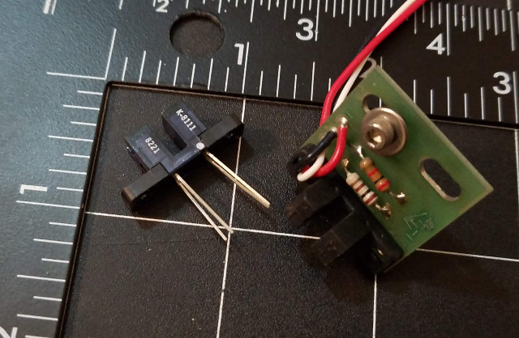
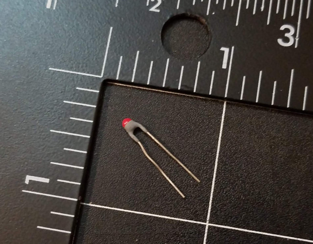
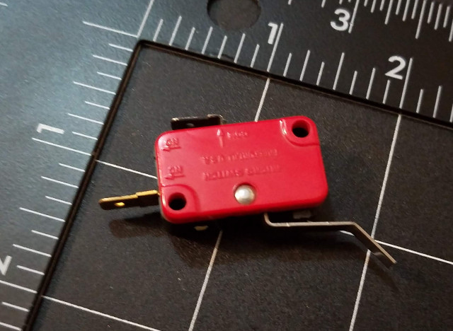
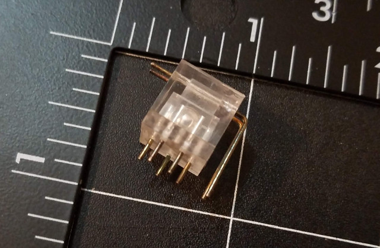

# Discrete Components

Individual components can be easily ordered from a variety of vendors, way too many to list unfortunately. I will however list some companies here I have had past good experiences with, along with some pictures of some useful discrete sensor components and what they can be used for.

 

## New Components

* Digikey - https://www.digikey.com/
* Mouser - https://www.mouser.com/
* Jameco - https://www.jameco.com/

Note: I understand these vendors are USA-centric, but they do ship internationally, and are probably the best way to get new and brand-name components at smaller quantities than you could get through many other sources. I may update this list in the future, if I get suggestions of other similar international sources, or as I find them.

 

## NOS (New-Old Stock) and Surplus Components

* All Electronics - https://www.allelectronics.com/
* Electronic Goldmine - https://www.goldmine-elec-products.com/
* Altronics - https://anatekinstruments.com/

Again, the above vendors are USA-centric, and from what I understand, surplus electronics sales tend to be a mostly American thing, as laws in other countries (ymmv) prohibit or severely limit such "recycling". Also, despite being "surplus" outlets, all of the above vendors also sell new components and other new items.

Finally, don't hesitate to look into discrete components from Amazon or Ebay...sometimes you can find interesting stuff there, too!

 

## Examples

### Photoresistors (aka LDR, CdS cells, etc)

### Phototransistors

### Slot Sensor

### Thermistor

### Microswitch (Contact Sensor)

### Tilt Sensor (Ball-in-Cage)

