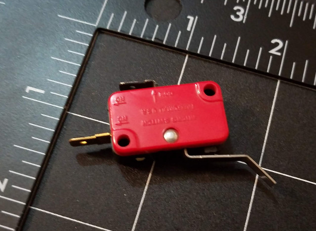
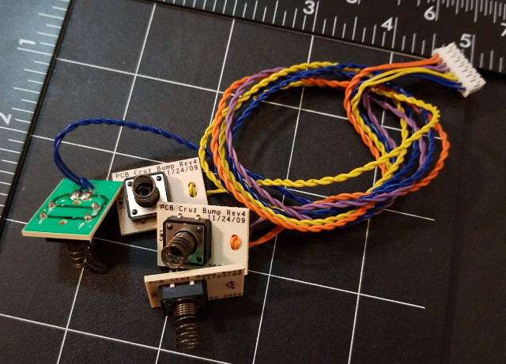

# Contact Sensors

Contact sensors are just what they sound like: A switch that is actuated when the robot comes into contact with an obstacle. They are probably the simplest kind of sensor that can be built for a robot, to give it a crude form of tactile stimulus.

 

## Microswitches

Consider the following image. The switch has two contact terminals: A common contact terminal (top), and the "Normally Closed" or "NC" contact (left side of switch).

What this means is that when the switch is not actuated, then contacts are closed (the switch is "ON"), and current can flow bewtween them. When the switch is actuated, via the bent lever arm at the bottom and left of the switch, the contacts open (the switch is "OFF").

You could attach "whiskers" (pieces of stiff but springy steel piano wire), or some kind of a bumper, to a pair of these microswitches, and mounted appropriately, such a system could let the robot know if it has collided with something on either side, or centered.

 

## Bump-switches

The following image show a set of basic bump switches.

They are essentially a low-cost momentary pushbutton switch mounted on to a small PCB. Affixed to the button of the switch is a small spring. When the spring is pressed, the force is more gently transmitted to the switch via the spring, and the switch will close. The spring acts as a "bumper" of sort for the more fragile switch. In a similar manner, steel whiskers or other means could be used to actuate the switch, in a similar manner to the microswitch shown earlier.
