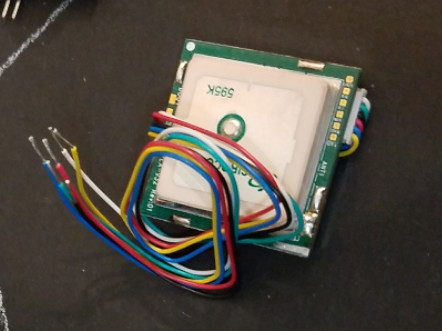

# GPS Modules

## Parallax PMB-648

There are a variety of different GPS modules available, but the one I had readily available in my junk pile was from Parallax. As I find others (I know I have some others somewhere - sigh), I'll update this section.

* [Parallax Microcontroller KickStart for PMB-648 GPS Module](https://learn.parallax.com/sites/default/files/download/1283/28500-PMB-648-GPS-Module-KickStart.zip)
* [Additional PMB-648 KickStarts](https://sites.google.com/site/parallaxinretailstores/home/gps-module-pmb-648-sirf)
* [Arduino + Parallax GPS module (PMB-648 SiRF)](https://www.jhongelectronics.org/2013/10/arduino-parallax-gps-module-pmb-648-sirf.html)
* [Arduino.cc - How to get Parallax PMB-648 GPS module working with Arduino UNO?](https://forum.arduino.cc/index.php?topic=125949.0)
* [Connecting a Parallax GPS module to the Arduino](https://playground.arduino.cc/Tutorials/GPS/)
* [Datasheet, Manual, and More!](../../datasheets/gps/parallax-pmb-648)