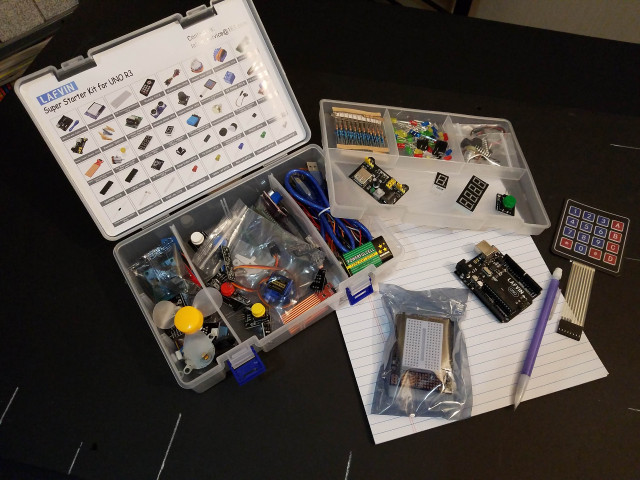

# Basic Sensor Kits

Basic sensor kits are widely available. They come in a wide variety, and not all kits have all the same sensors (but the number "37" seems to be common). 

Most have a number of useful sensors and other components for robotics experimentation. You can also find kits, like the one I have (above) that come with an Uno or Mega (or an adapter board to connect to a Raspberry Pi)

Here are some links to different kits (again, these are for reference only - I can't reccommend any one particular kit or part over another, so carefully do your research before buying any).

* HiLetgo 37 Sensors Assortment Kit - https://www.amazon.com/HiLetgo-Sensors-Assortment-Raspberry-Projects/dp/B01N5910XS

* 37 Sensors Assortment Kit - https://www.amazon.com/Sensors-Assortment-Raspberry-Robot-Projects/dp/B087YZZJ93

* LAFVIN 37 in 1 Sensor Module Kit - https://www.amazon.com/LAFVIN-Arduino-Mega2560-Mega328-Tutorial/dp/B07DW391KT

* KEYESTUDIO 37 in 1 Sensor Kit - https://www.amazon.com/KEYESTUDIO-Sensor-Arduino-Raspberry-Micro/dp/B016KIXSMM

Another interesting kit that I thought I'd mention, is this one:

* ESP32 CAM Arduino Kits - https://www.amazon.com/Snapshot-Detection-Recognition-Bluetooth-Compatible/dp/B07ZF95CCP

While it doesn't have a bunch of sensors, it does come with a camera and ESP32. I can't go into super-detail, but you can find information out there on how to program the ESP32 using MicroPython and access the camera. Hook that up, plus the pin(s) to control your platform, and you have a very powerful self-driving vehicle and computer vision experimentation platform!