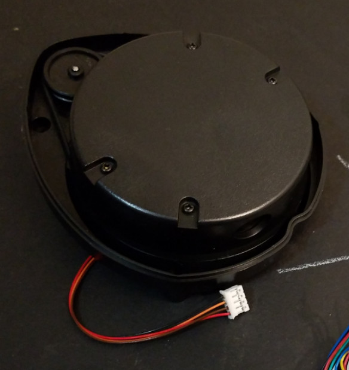

# LIDAR

## Neato XV-11 / XV-21 LIDAR Sensor

These can be found as surplus and/or as replacement parts. Alternatively, you might find an entire Neato robot somewhere that has a working sensor (plus a ton of other fun parts!). However you obtain one, here is some information about how to interface to one:

* [Research Papers](../../datasheets/neato-lidar)
* [Hacking XV-11 Lidar (Cheap lidar option)](https://scratchrobotics.com/2018/04/25/hacking-xv-11-lidar/)
* [Using Neato LIDAR with your embedded board (archived)](https://web.archive.org/web/20150326122026/http://profmason.com/?p=13246)
* [getSurreal's XV Lidar Controller Code](https://github.com/getSurreal/XV_Lidar_Controller)
* [Neato XV-11 LIDAR - Simple to run, no dependencies](https://github.com/RickoLacharity/Neato-XV-11-LIDAR)