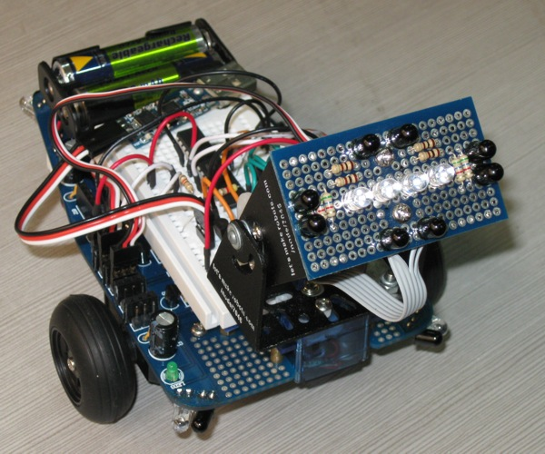

# Low Vision Sensors

Low vision sensors generally fall under the category of "computer" or "machine" vision - albeit as a very myopic form.

Such sensors differ from a simple light sensor in that they usually incorporate multiple light sensor elements (but far fewer than a digital camera would use), and sometimes also use focusing or other elements to aid in shape and direction recognition tasks. Below are a few examples I have found on the internet regarding this fascinating and under-appreciated form of robotic sensing.

* [Cheap home made IR compound eye by OddBot (2009)](./files/robot_compound_eye.zip) - Note: The image above shows OddBot's compound eye...
* [Using photoresistor array in robotic applications by Dusan Grujic (1999)](./files/photoresistor-arrays.zip)
* [A Low-Resolution Vision Sensor - DG Whitehead etal (1984)](./files/a_low-resolution_vision_sensor_1984_whitehead.pdf)