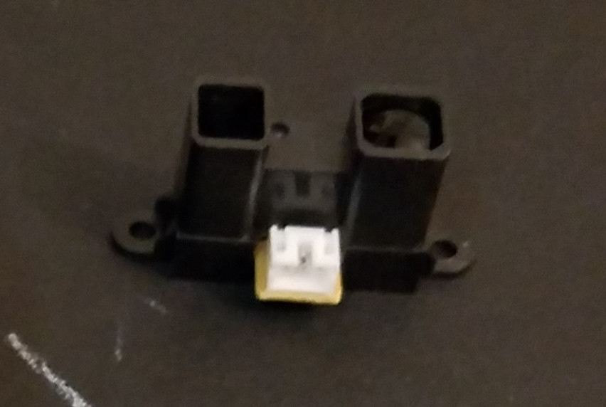

# Sharp IR Sensors

Sharp IR sensors  are typically used to determine distance from an object. They do so by sending out a "beam" of infrared light which reflects off of nearby objects. The reflected light bounces back to the sensor, which has a linear analog light sensor (behind a focusing lens). 

Along this sensor, the light reflected illuminates one area more than surrounding parts. This area returns a signal whose "strength" is proportional to where the light landed on it. This proportional value is read and can be interpreted to determine how far away the object is.

* [Datasheets and App Note](../../datasheets/sharp-ir)
* [Working Principles / Example Code (eprolabs.com)](https://wiki.eprolabs.com/index.php?title=IR_Distance_Sensor_GP2YOA21YK)
* [Ranger Comparison (Acroname)](https://acroname.com/articles/sharp-infrared-ranger-comparison)