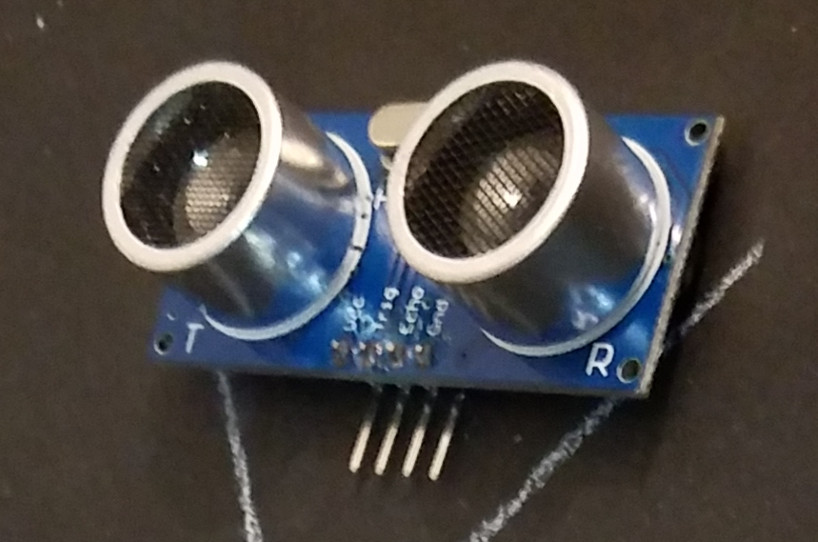

# Ultrasonic Sensors

Ultrasonic sensors are typically used to determine distance from an object. They do so by sending out a signal (ultrasonic audio "ping") which travels at the speed of sound and reflects off of nearby objects. Immediately after the signal is sent, the sensor is switched to "listen" for the bounced back signal (the "echo"), and using simple calculations, it can be determined how far away the object is.

 

## HC-SR04

I didn't purchase mine from SparkFun, but since it's an open-source design, they sell their own version, which should be compatible.

* [SparkFun Electronics SEN-15569](https://www.sparkfun.com/products/15569)
* [Tutorial - Instructables](https://www.instructables.com/Simple-Arduino-and-HC-SR04-Example/)
* [SEN-15569 - Example Code](https://github.com/sparkfun/HC-SR04_UltrasonicSensor)

 

## MaxBotix

[MaxBotix Ultrasonic Sensors](https://www.maxbotix.com/)

 

## SensComp (Polaroid 6500)

[SensComp Ultrasonic Sensors](http://www.senscomp.com/)

 

## Surplus Polaroid

You can essentially get the near equivalent to the SensComp / Polaroid 6500 sensor, in a far cheaper fashion, by removing the module from an old Polaroid AF camera, as detailed here:

[Modifying Sonar Ranging Modules from Late Model Autofocus Cameras](http://www.uoxray.uoregon.edu/polamod/welcome1.html)

Also:

[SONAR as I have Done It - SRS Encoder](http://www.seattlerobotics.org/encoder/200010/dlcsonar.html)

I have a bunch of these cameras, and I intend to make a Junkbotix video on how to disassemble and use these modules - but the above link is a great start until then...