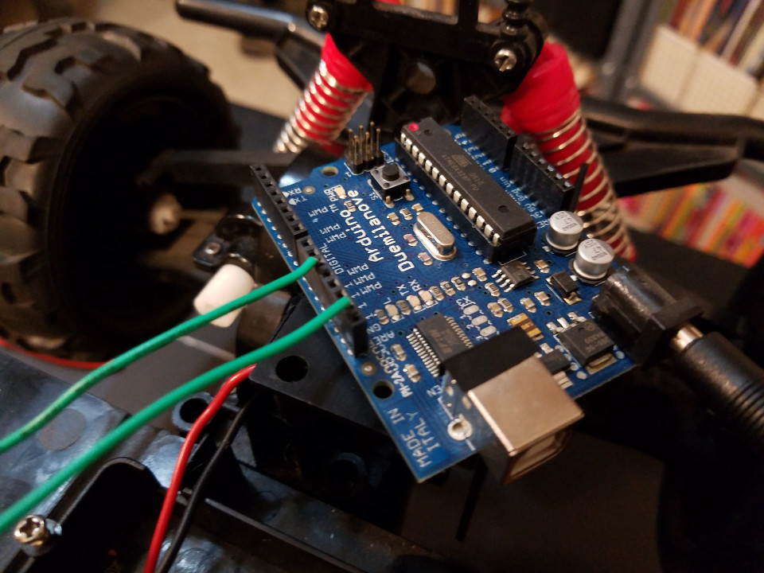
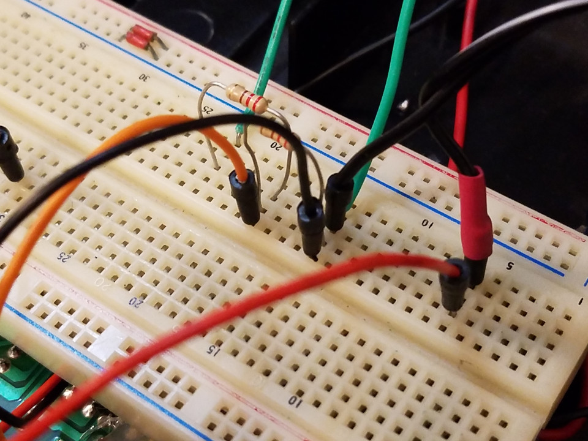
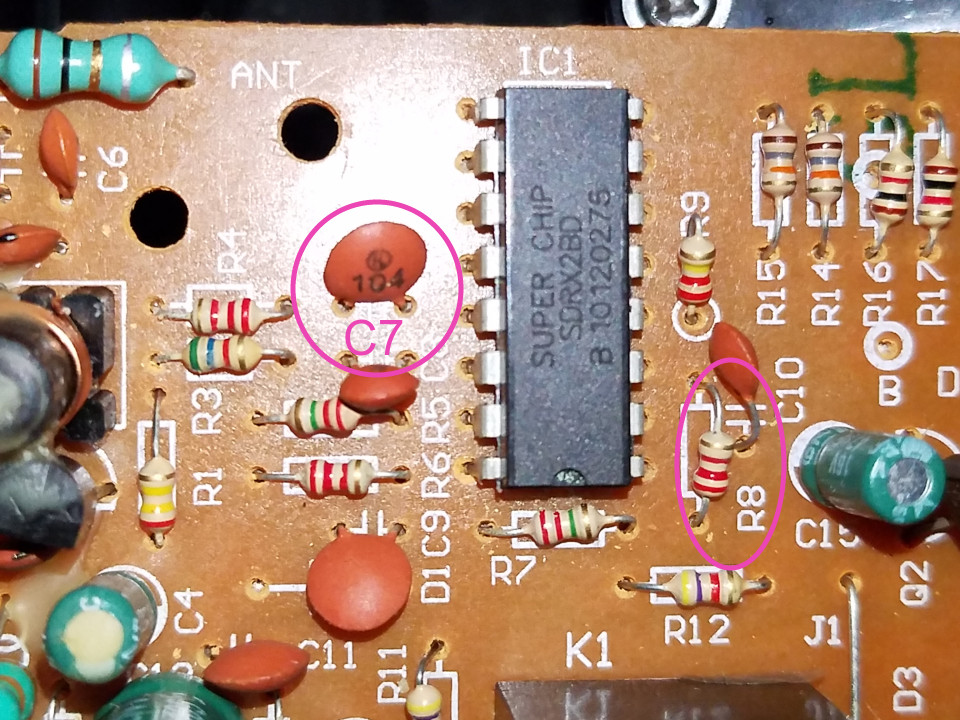
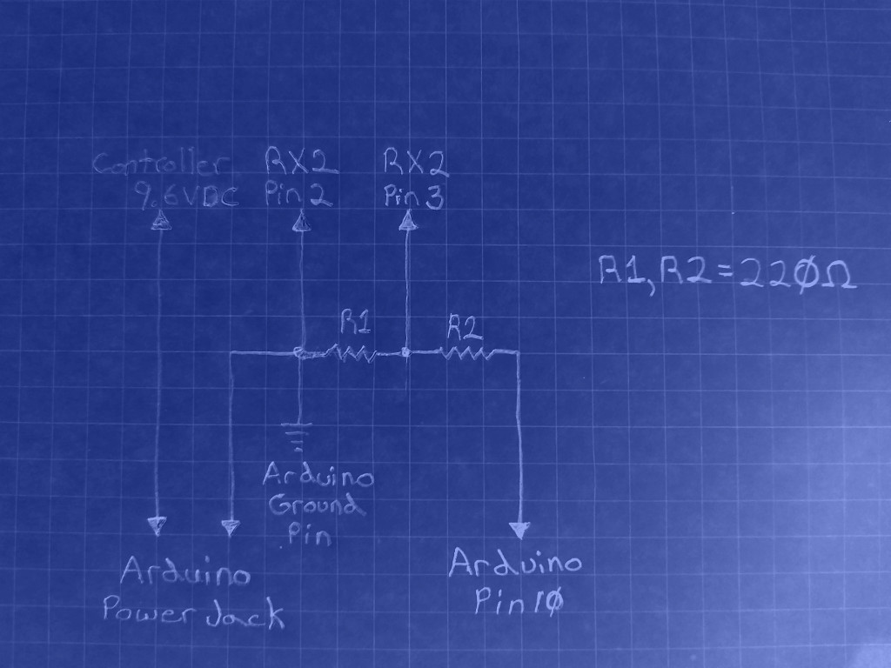

# Arduino Stuff

## Signal Injection

Before using these examples, be sure to check out the section on "Direct Signal Injection":

[Direct Signal Injection](../interfacing/signal-injection)

This is one of the Arduino boards (Duemilanove) I used:

This shows how to build the interface on a breadboard:

I removed capacitor C7 and resistor R8 from the controller (your controller will be different, of course):

Connect to the RX2 chip and controller board using the schematic:

## Note:

You can use any power source you want to for the Arduino, but you must connect up the ground (negative) of the controller with the Arduino's ground. Otherwise, the circuit may or may not work properly.

Also, the examples below were written and tested on both an Arduino Uno and an Arduino Duemilanove. No other Arduino board was tested, but others should work (the code may need changes).

## Examples

The first example demonstrates the minimum to "inject" a signal into pin 3 of the RX2 chip, and activate the "Forward" function.

[Simple Demo](./RX2_TX2_Simple)

The next example demonstrates using a "state machine" to cycle through multiple functions (specifically "forward", "backward", "left" and "right").

[State Machine Demo](./RX2_TX2_StateMachine)