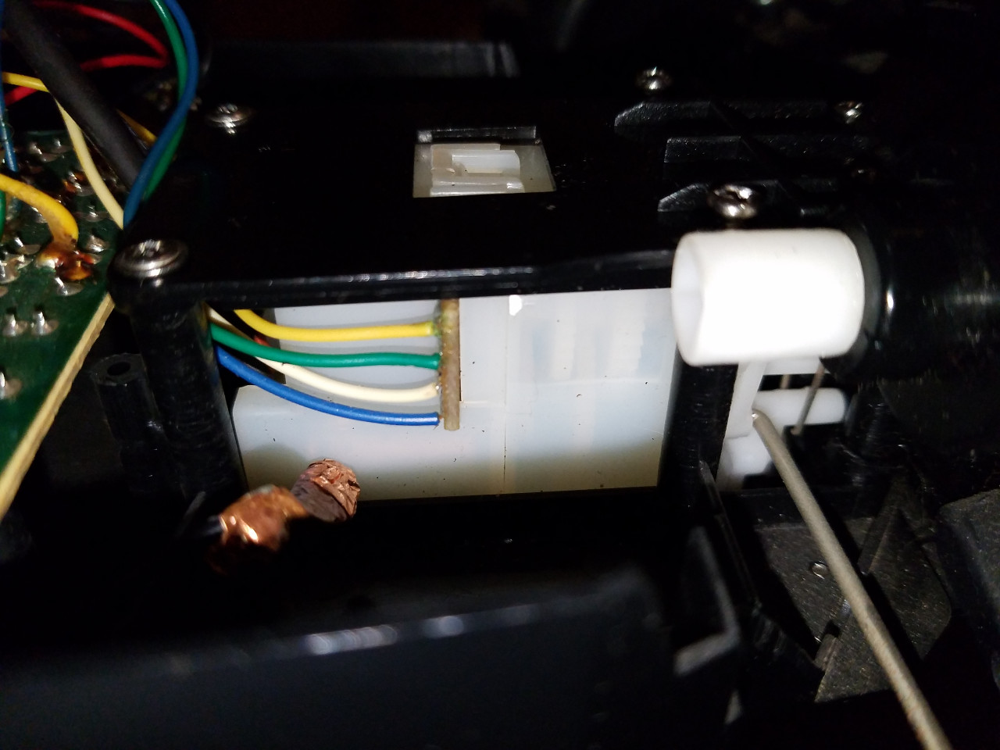
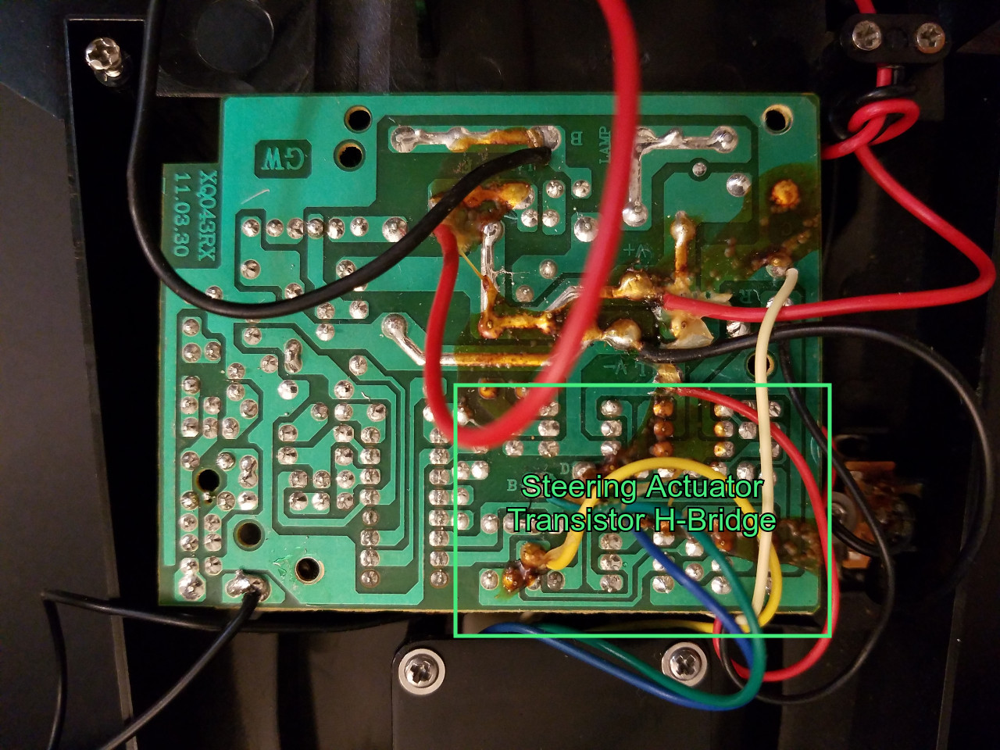
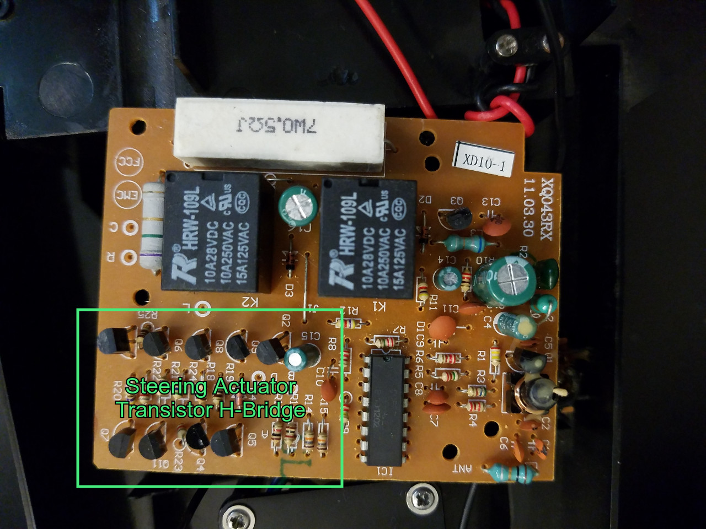
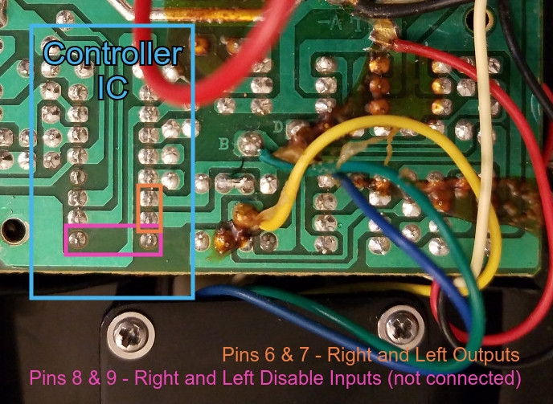
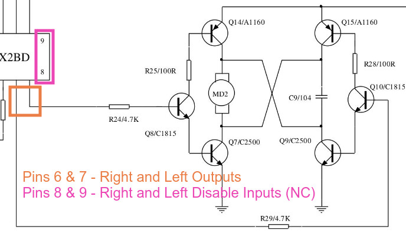

# Steering Actuator - A Curious Observation

The steering actuator on this vehicle is very curious in its design, which I have noted in the videos.

Mainly, because in addition to the wires for the motor that controls the actuator, it has four additional wires:

 

These wires appear to be connected in some manner to the steering actuator's h-bridge:

 
 

## What makes this strange?

The reason that this is so curious, is that the datasheet for the [SDRX2BD](../datasheets/controller) indicates that the IC only has outputs for left and right steering (pins 6 & 7), and the input pins (8 & 9) for disabling these functions are not hooked up on my car's controller:

Furthermore, the implementation example schematic in the datasheet doesn't show anything about such functionality:

As a final note, I have never seen any other toy RC vehicle that used this chipset (the TX2-RX2 and clones) have any kind of connections to the steering actuator other than directly to the motor - in other words, usually just two wires, instead of the "2+4" arrangement we see here.

## My analysis and thoughts

My best guess is that these wires serve in some manner to inhibit or "limit" the h-bridge output, perhaps to prevent it from drawing too much current, or maybe to automatically center it, or something of that nature.

Until I can reverse-engineer a schematic for that section of the controller board (not a trivial task), it may remain a mystery. Further testing of direct control may reveal additional clues, too.